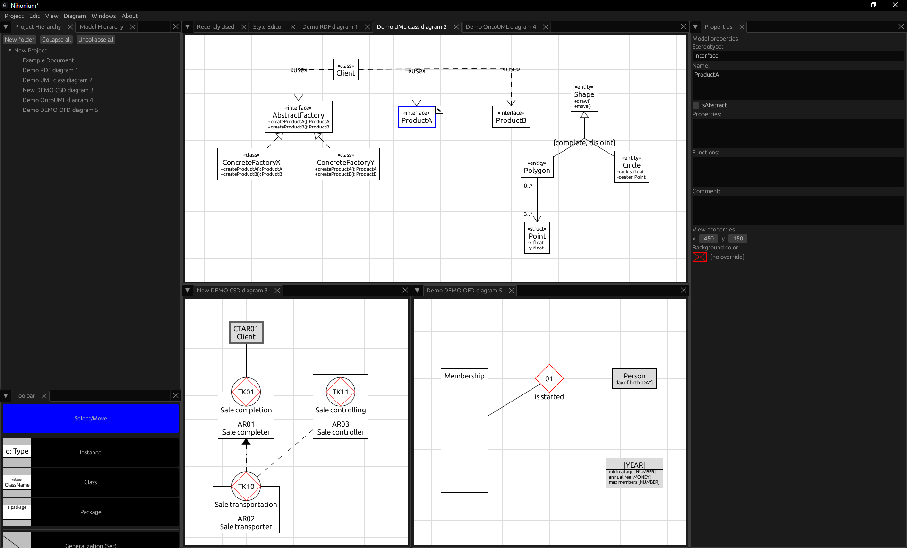

# Nihonium

## What is it?

Nihonium is a small diagramming / CASE modelling platform written in Rust using [egui](https://github.com/emilk/egui).

> [!WARNING]
> Nihonium is currently in relatively early stages of development. It is recommended to save often and use version control software such as Git in order to prevent all your data being irreversibly lost.
>
> To streamline the development, not being able to open a project file on a different build than the one it was created on is currently not considered a bug, though you may open an issue to inquire about manually upgrading the project files to the newest version.
>
> Pull Requests are currently not accepted, however feature requests and bug reports are very welcome.



## How to run it?

### In your browser

You can visit https://dolezvo1.github.io/nihonium/, where it should be running.

### As a native binary

If you don't have `cargo` on your system, [install it first](https://rustup.rs/).

Assuming you have `cargo` installed, you only need to

```shell
$ git clone git@github.com:dolezvo1/nihonium.git
$ cd nihonium
$ cargo run --release
```
