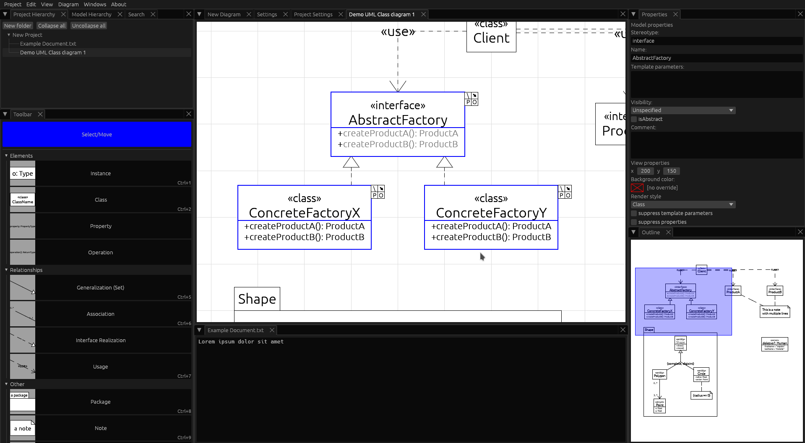

# Nihonium

## What is it?

Nihonium is a small diagramming / CASE modelling platform written in Rust using [egui](https://github.com/emilk/egui).

> [!WARNING]
> Nihonium is currently in relatively early stages of development. It is recommended to save often and use version control software such as Git in order to prevent all your data being irreversibly lost.
>
> Pull Requests are currently not accepted, however feature requests and bug reports are very welcome.

For basic operation instruction as well as advanced tips and tricks see [user manual](USER_MANUAL.md).



## How to run it?

### In your browser

You can visit https://dolezvo1.github.io/nihonium/, where it should be running.

Note: The following browser settings are recommended for optimal experience:
* enable asking for download file location (set `about:config` > `browser.download.useDownloadDir` to `false`)
* disable middle mouse button pasting (set `about:config` > `middlemouse.paste` to `false`)

### As a native binary

If you don't have `cargo` on your system, [install it first](https://rustup.rs/). For more details on installation and prerequisites see [the rustup book](https://rust-lang.github.io/rustup/index.html).

Assuming you have `cargo` installed, you only need to

```shell
$ git clone git@github.com:dolezvo1/nihonium.git
$ cd nihonium
$ cargo run --release
```
