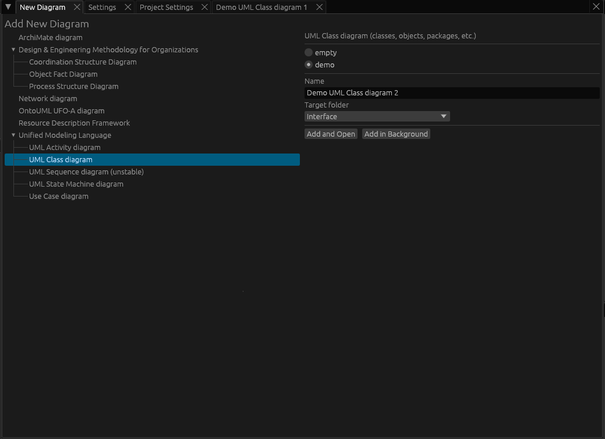
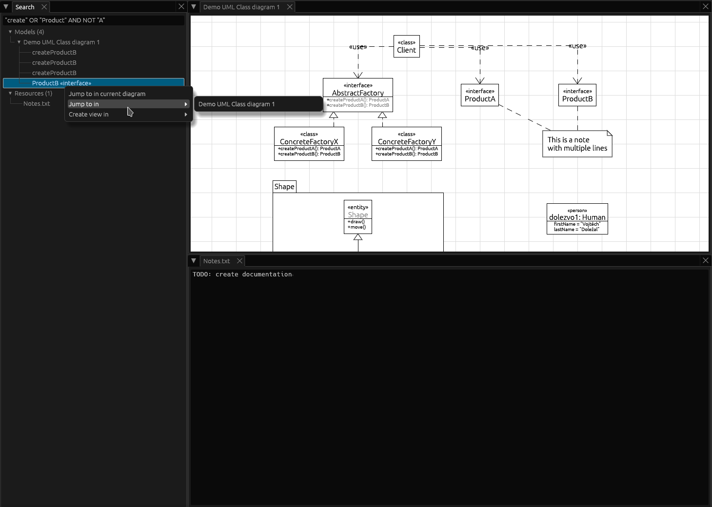
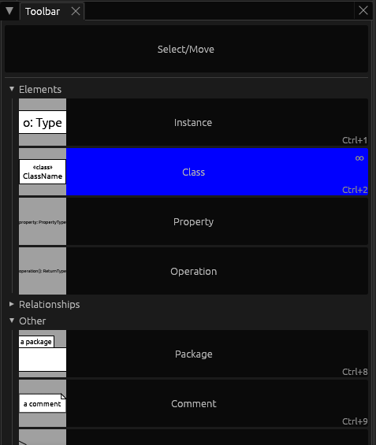
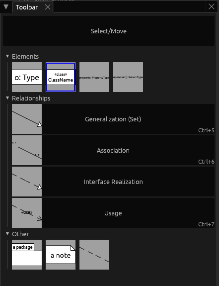
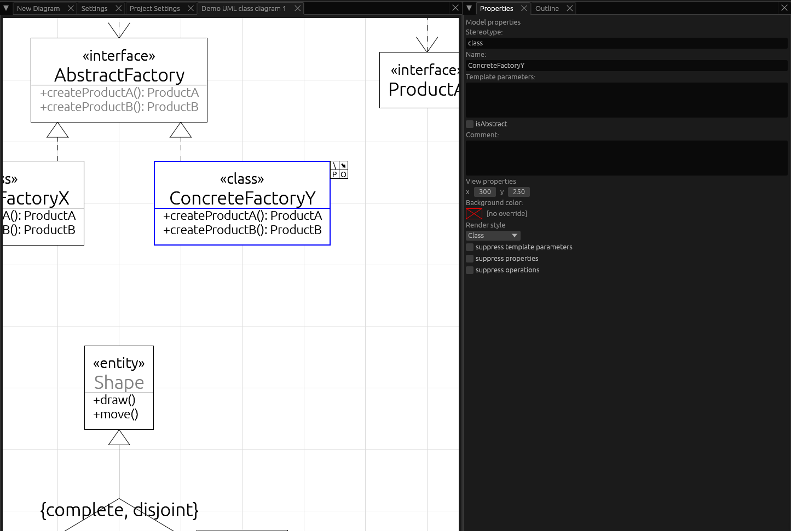
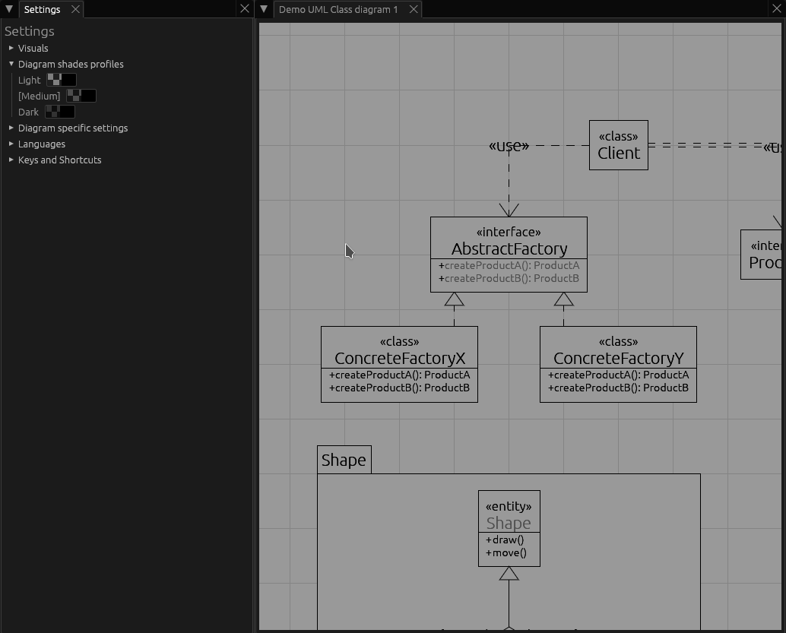
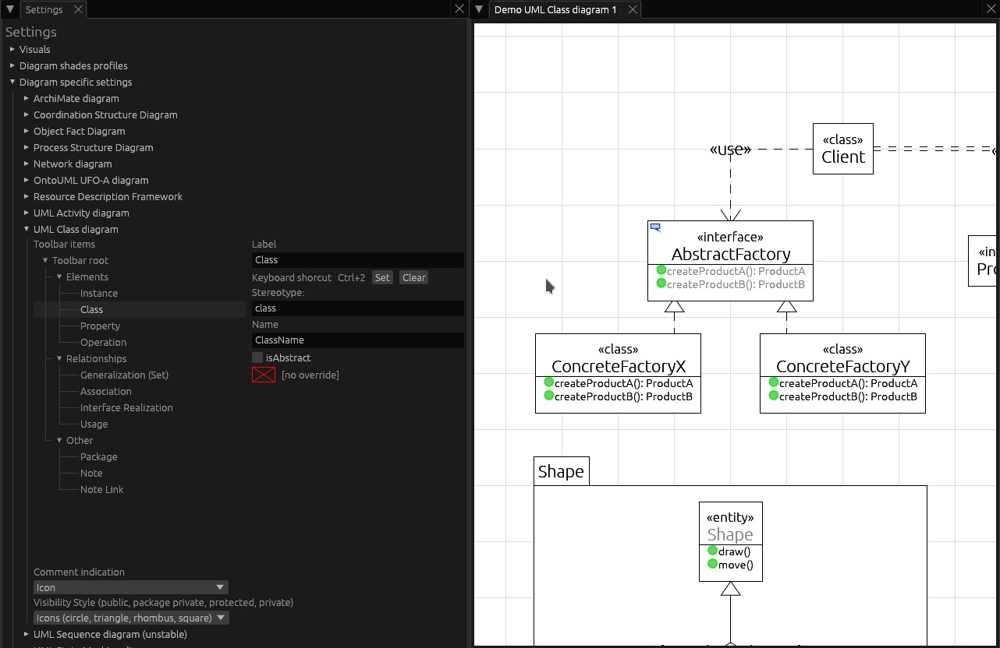
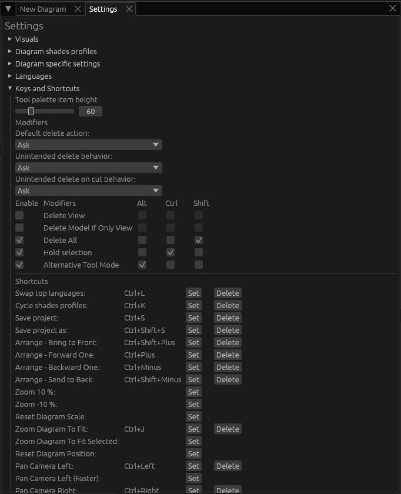
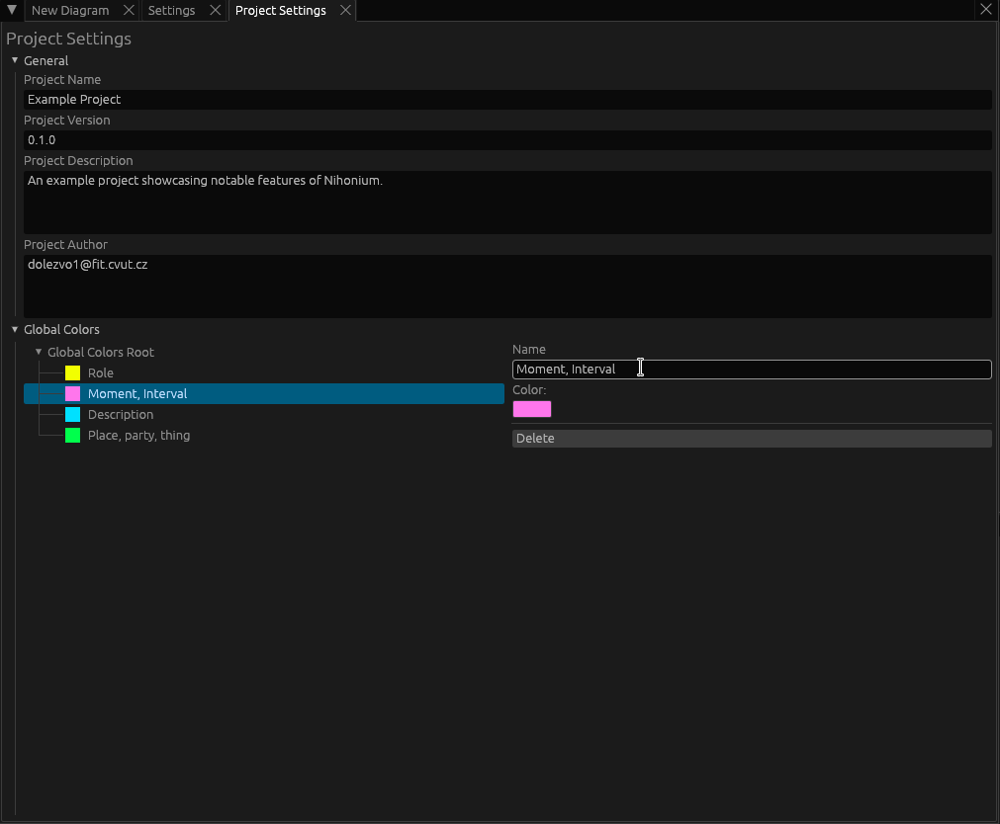

# Nihonium User Manual

## New Diagram Tab

The New Diagram tab shows list of supported diagram types. After selecting a diagram type, specific options can be selected, such as whether the diagram should be empty or contain some predefined content (usually a demo of the notation is offered).

## Project Hierarchy Tab

The Project Hierarchy tab shows the project structure, namely diagrams, documents, and folder structure containing them. The context menu may be used to create, open, modify or delete elements of the project structure.

## Model Hierarchy Tab

The Model Hierarchy tab shows model of the currently selected diagram. The fact that an element is represented in the diagram is indicated with `[X]` to the left of the element name. The context menu may be used, among other, to jump to a specific element in the current diagram or to (de)instantiate an element within it.

## Search Tab

The Search tab provides a way to search all models and resources. The search expression may contain logical operators `AND`, `OR` and `NOT`.

## Toolbar Tab

The Toolbar tab shows a list of tools separated into categories, as well as previews of the elements that will be created by the tools.

Selecting a tool in the list with the primary mouse button engages the repeated mode (indicated by `∞`). Selecting a tool in the list with a secondary mouse button engages the one-shot mode (indicated by `1`).

Scrolling with the scroll wheel while holding `Ctrl` key changes the size of toolbar items.

The toolbar tools and categories for a given diagram type may usually be modified in `Settings` > `Diagram specific settings`.

## Properties Tab

The Properties tab shows available properties of the currently selected element (if some elements are selected) or the current diagram (if no elements are selected). When multiple elements are selected, the changes are usually applied to all selected elements where appropriate.

## Outline Tab

The Outline tab shows all content in the current diagram as well as relative position of the viewport.

Clicking or dragging within the outline tab may be used to quickly change the viewport position.

## Settings Tab

Settings set through the Settings tab are persistent and project independent.

The visuals section includes visual options such as Light/Dark UI theme, UI scaling, as well as customization options for egui_dock.

The diagram shades section serves to control diagram shades, which can be used to ease the eye strain when working in low light environment. Default shortcut to cycle shades is `Ctrl+K`.

The diagram specific settings section allows for various diagram-specific customizations, such as modification of the toolbar items, or modification of diagram visuals (where supported).

The keys and shortcuts section allows for various modifications of the behaviour as well as setting of the shortcuts.

## Project Settings Tab

Project settings are project-specific (i.e. stored and loaded along with a given project). This most notably includes project metadata (Name, Version, Description, Author) and Global Colors.

# My project files cannot be opened anymore

You may find yourself in a situation where your project files no longer can be opened by the program. If you've been consistently using some versioning system (such as git or creating dated copies using "Save As"), you most likely don't have to worry too much. If you're using the web version, you also most likely don't have to worry. If you're using the desktop version and cannot open files created by the same commit version you're currently using, you may start to worry a little.

Since many aspects of Nihonium are is still being actively researched, breaking changes do happen. To soften this blow, Nihonium stores the commit hash of the program version which last saved the project in the project manifest file (look for `format_version`), allowing you to backtrack to last Nihonium version which can be assumed to work with the given project file.

It must be said that there is also a possibility of the project files being corrupted due to a bug occurring when they were being saved, or there may be a bug when opening them. For this reason it is not recommended to use Nihonium without some way of external versioning at the moment.

Regardless of which is actually the case, you can always try opening an issue on GitHub or sending me the files directly, in particular if you believe it is a bug. In case of a breaking change I may also be able to upgrade your the project files to work with the latest version.
